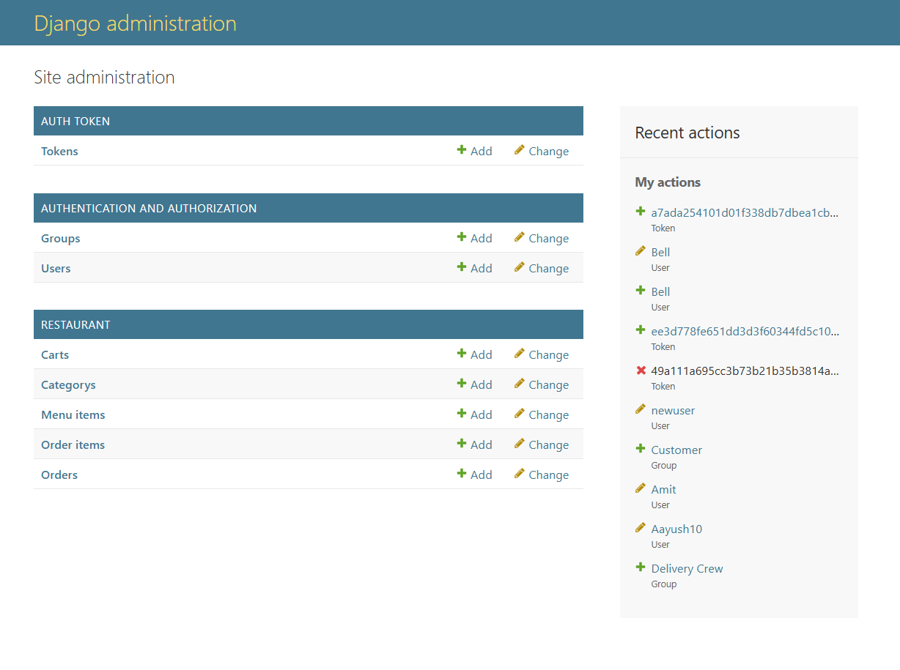
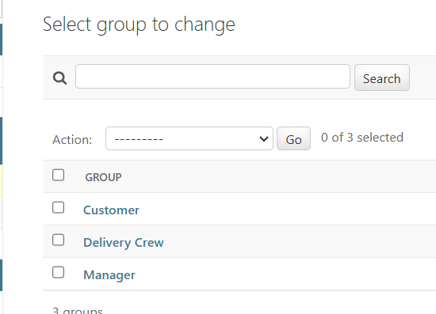
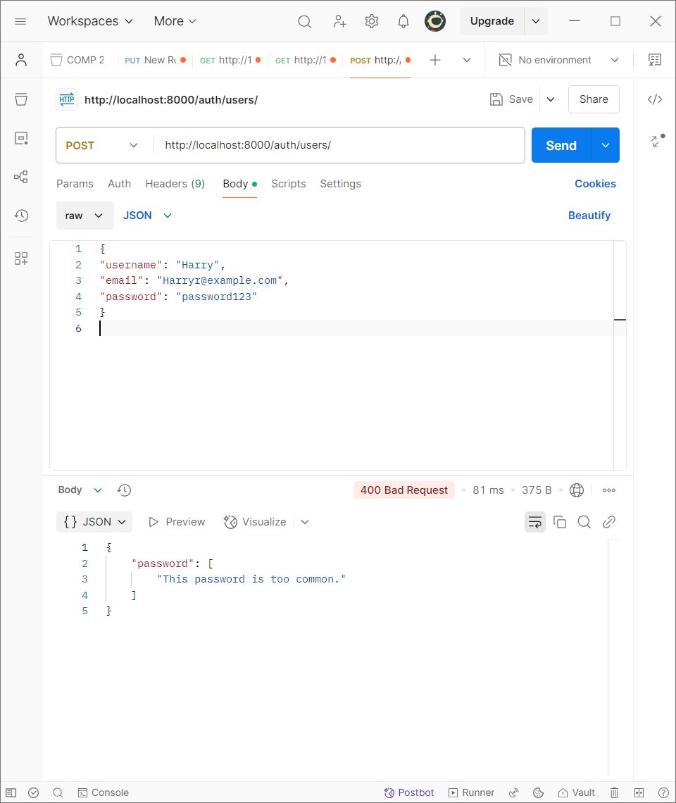
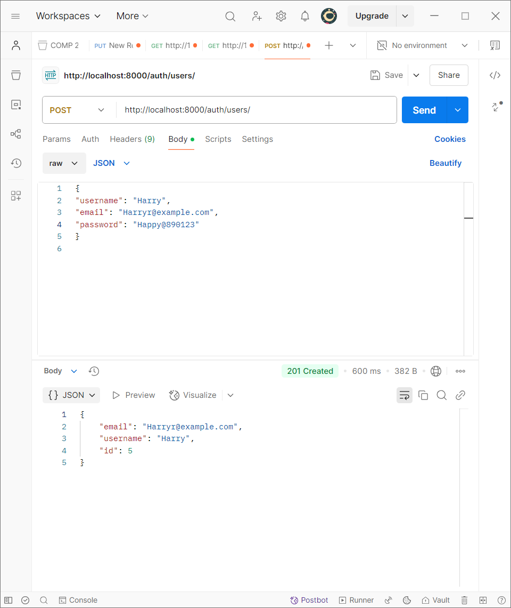
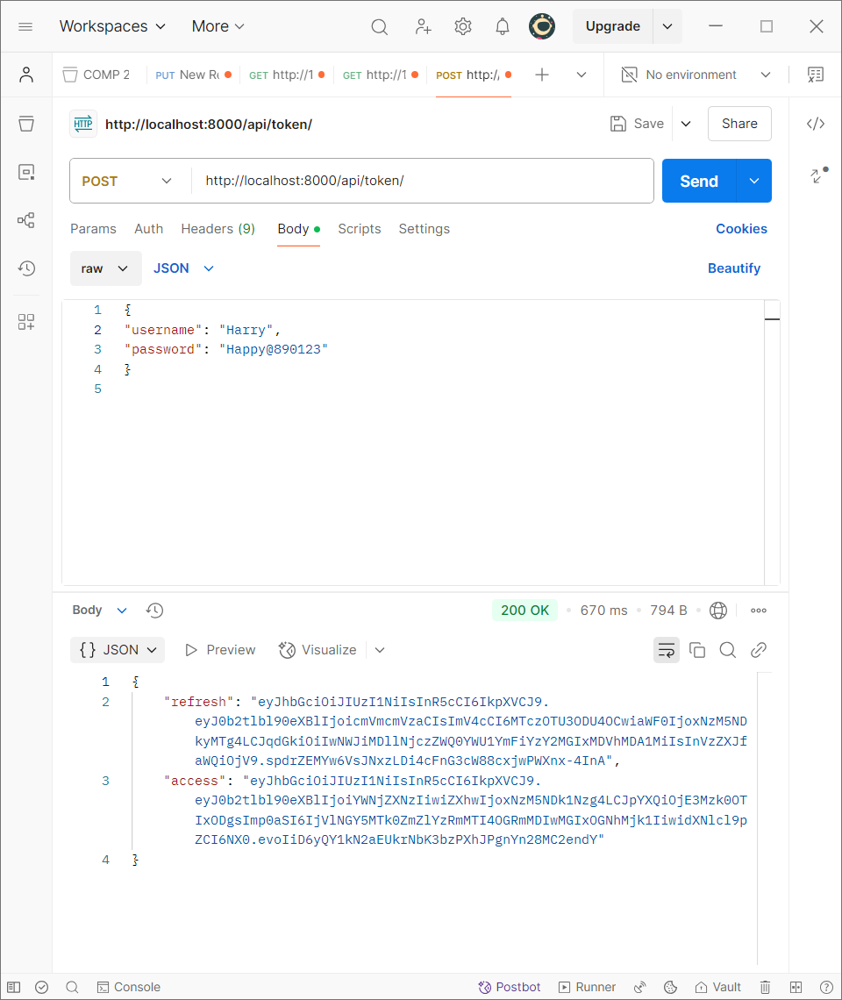
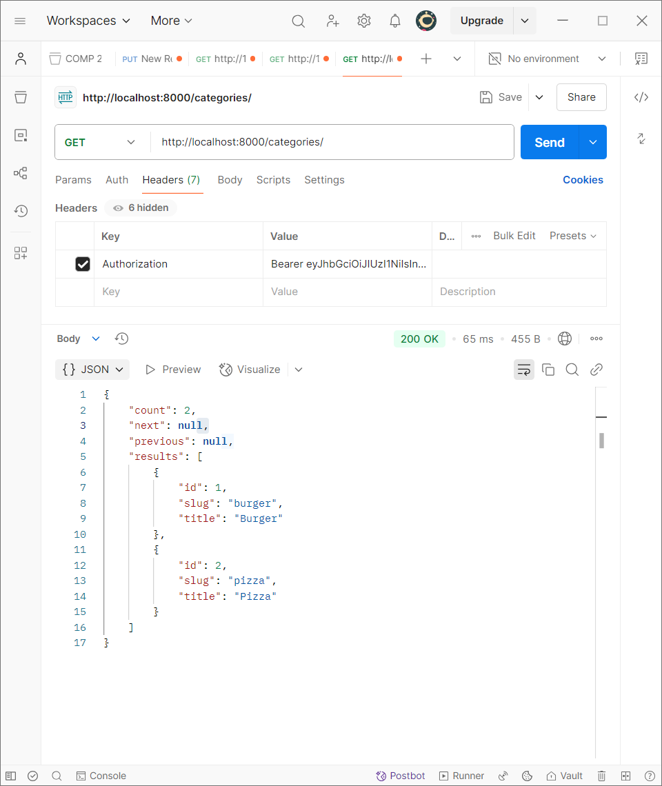

# Little Lemon Restaurant API


---

## 🍽️ Project Description
This project implements a **REST API** for the **Little Lemon** restaurant using Django and Django REST Framework. The API supports three types of users: **Managers, Customers, and Delivery Crew**. It provides functionality for user management, menu item handling, order processing, and delivery management.

---

## ✨ Features
✅ **User registration and authentication with JWT**  
✅ **Role-based access control** (Manager, Customer, Delivery Crew)  
✅ **Menu item management (CRUD operations)**  
✅ **Order placement and management**  
✅ **Cart functionality for customers**  
✅ **Delivery assignment and status updates**  
✅ **API rate limiting and security enhancements**  

---

## 🛠️ Technology Stack
- **Django**
- **Django REST Framework**
- **JWT Authentication**
- **Docker (initial phase)**

---

## 📌 API Endpoints
- **`/auth/`** - User authentication endpoints
- **`/categories/`** - Menu categories
- **`/menu-items/`** - Menu items with filtering, searching, and ordering
- **`/cart/`** - Customer's cart management
- **`/orders/`** - Order placement and management
- **`/manager-only/`** - Manager-specific functionalities
- **`/users/<id>/assign_to_delivery_crew/`** - Assign users to delivery crew

---

## 🚀 Installation
### 1️⃣ Clone the Repository
```sh
git clone https://github.com/sapkota-aayush/LittleLemon.git
cd LittleLemon
```
### 2️⃣ Create and Activate a Virtual Environment
```sh
python -m venv venv
source venv/bin/activate  # On Windows use `venv\Scripts\activate`
```
### 3️⃣ Install Dependencies
```sh
pip install -r requirements.txt
```
### 4️⃣ Apply Migrations
```sh
python manage.py migrate
```
### 5️⃣ Run the Development Server
```sh
python manage.py runserver
```

---

## 🔑 Authentication
The API uses **JWT (JSON Web Tokens)** for authentication. To obtain a token, send a POST request to `/api/token/` with valid credentials.

---

## 🔐 Permissions
👨‍💼 **Managers**: Can perform all operations.  
👤 **Customers**: Can browse menu items, manage their cart, and place orders.  
🚚 **Delivery Crew**: Can view and update assigned orders.  

---

## ⏳ API Rate Limiting
API calls are **limited to 5 per minute** for authenticated users.

---

## 🖼️ Tested Using Postman
Here are some tested API samples using **Postman**:

### 🔹 Django Admin Panel (Models View)


### 🔹 Groups in Django Admin Panel


### 🔹 User Registration (Weak Password Error)


### 🔹 User Registration (Successful)


### 🔹 JWT Token Generation


### 🔹 Fetching Categories with Token Authentication



## 🤝 Contributing
Contributions are welcome! Please read our **[Contributing Guidelines](CONTRIBUTING.md)** for details on our code of conduct and the process for submitting pull requests.

---

## 📜 License
This project is licensed under the **MIT License** - see the **[LICENSE](LICENSE)** file for details.

---

## 📧 Contact
For any queries, please contact **aayush@aayussh.com**.

